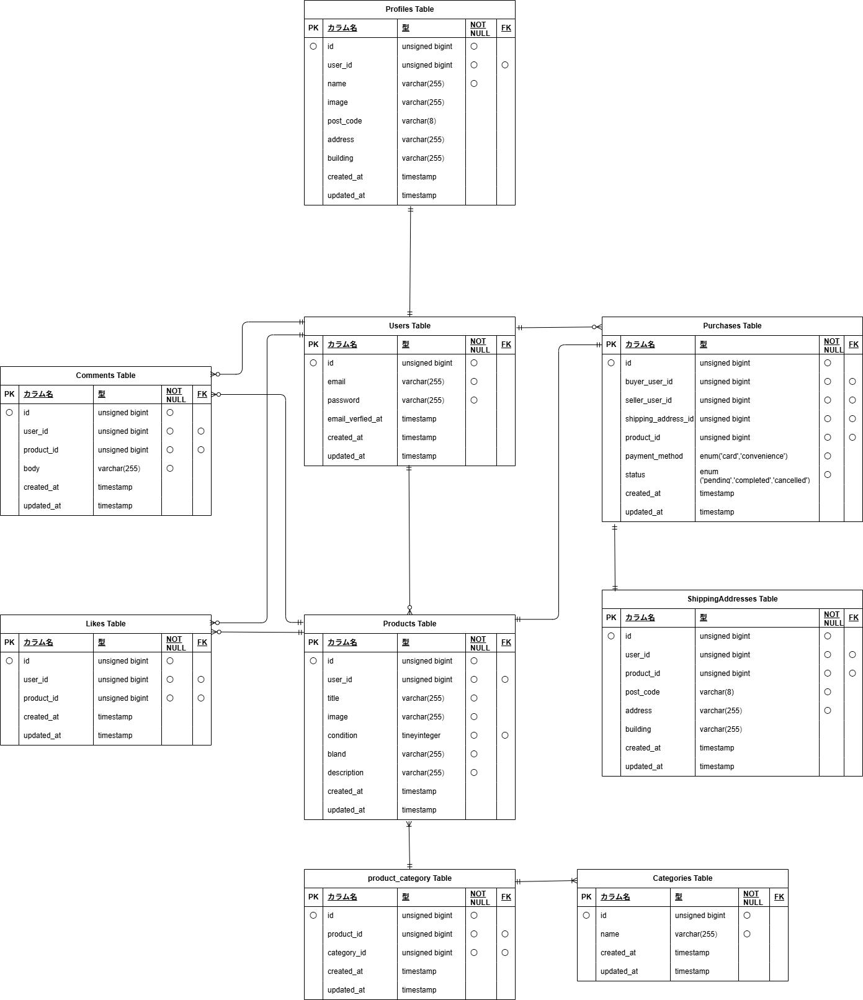

# mock-case1  フリマサイト  
  
## 目的  
模擬案件としてフリマサイトを作成する。実装のテーマは下記に記載。  
- 登録時はメール認証。  
- 出品・購入とも可能。（ただし購入時は1購入1商品とする）  
- いいねやコメントをつけることが可能。  
またlaravel12にて実装を行う。  
  
## 環境構築  
- Ubuntu使用にて構築  
  
## Dockerビルド  
- git clone git@github.com:ErikoKikuchi/mock-case1.git  
- cd mock-case1  
- git remote set-url origin 作成したﾘﾎﾟﾘｼﾞﾄﾘのURL  
- docker compose up -d --build  
  
## Laravel環境構築  
- docker compose exec php bash  
- composer install  
- 開発環境を立ち上げる場合はcomposer create-project "laravel/laravel=12.*" . --prefer-dist  
- 開発環境では Asia/Tokyo に設定済  
- 必要あれば権限設定　sudo chmod -R 777 src/*(windowsの場合)  
- cp .env.example .env  
（DB_HOST=mysql, DB_DATABASE=laravel_db, DB_USERNAME=laravel_user, DB_PASSWORD=laravel_pass）  
- php artisan key:generate  
- php artisan migrate  
- php artisan db:seed  
- php artisan storage:link  
- このプロジェクトではviteを使用しています。フロントエンドのビルドには Node.js と npm が必要です。  
- npm install(package.jsonのあるディレクトリで作成)
- vite.config.js で build.outDir を設定,app.jsに読み込むファイルを設定
- npm run build

  
## テスト用には下記の通り環境構築  
- mysqlコンテナにrootユーザーでログインし'demo_test'データベースを作成  
- config/database.phpの修正（'database' => 'demo_test','username' => 'root','password' => 'root'）  
- cp .env .env.testingを用意（APP_ENV=test, APP_KEY=  , DB_DATABASE=demo_test, DB_USERNAME=root, DB_PASSWORD=root）  
- php artisan key:generate  
- php artisan migrate --env=testing  
- phpunit.xmlの編集（server name="DB_CONNECTION" value="mysql_test"/, server name="DB_DATABASE" value="demo_test"/）  
- php artisan storage:link  
  
## 開発環境  
- 初期登録画面（http://localhost/register）  
- (画面フロー：初期登録→メール認証→プロフィール登録→商品一覧)  
- ログイン画面（http://localhost/login）  
- (画面フロー：ログイン画面→商品一覧)  
- 商品一覧画面（http://localhost/）：未ログイン時は商品一覧（全体）画面へ遷移、ログイン済でプロフィール未完成の場合はプロフィール編集、プロフィール完成している場合はマイページへ遷移  
- （画面フロー：商品一覧→商品詳細→ログイン→購入画面リダイレクト）  
- 商品一覧画面：ログイン後  
- （画面フロー1：商品一覧→出品ボタン押下→商品の出品登録→商品一覧）  
- （画面フロー2：商品一覧→マイページボタン押下→マイページ→出品した商品および購入した商品の確認可能、プロフィル編集ボタン押下によりプロフィール編集画面へ）  
- （画面フロー3：商品一覧にはおすすめ表示(今回は全表示)といいねした商品の表示が可能→商品カード押下→商品詳細画面→いいね・コメント可能、購入手続きボタン押下可能）  
- （画面フロー4：購入手続きへ→商品購入画面で決済情報選択。デフォルトで現住所表示→変更するボタンで住所変更可能）  
- （画面フロー5：決済情報をカードにした場合はサンプルキーを使用してstripe決済画面に接続、コンビニ決済にした場合はマイページへ遷移）  
- ＊注記：実際の決済は行わないため状態管理を行い、購入によりpendingへ移行させ、出品者画面ではsold表示で他者の購入を不可とし、購入者画面ではpendingのため支払い完了およびキャンセルボタンを押せるように実装した。実際に購入した場合は支払い完了ボタンを押すことでpaidに移行させ、支払い完了の表示をした。（本来は支払いに関しては出品者確認必要だが、今回は省略して購入者操作のみで完了させた）  
- （画面フロー6：商品一覧→ログアウト）  
  
## 使用技術(実行環境)  
- php:8.3-fpm  
- Laravel:12.44.0  
- MySQL:8.4.7  
- nginx:1.27.5  
  
## ER図・データベース設計  
   
